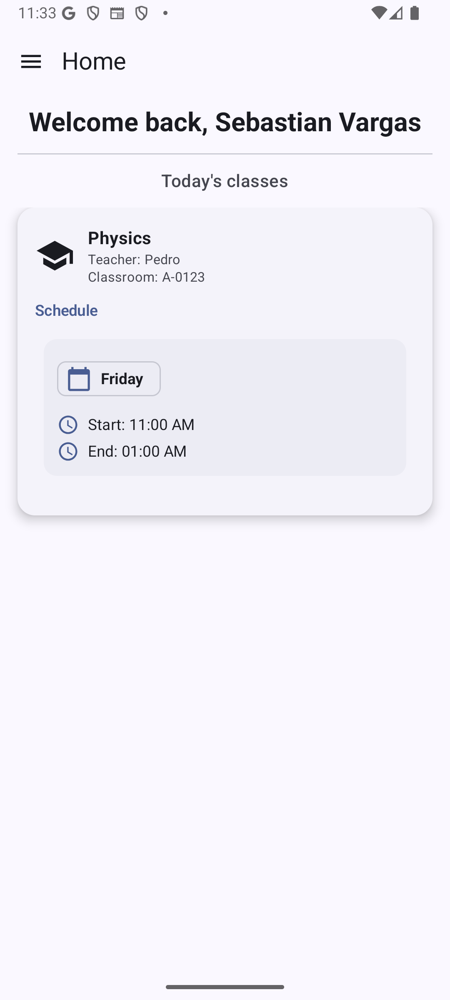
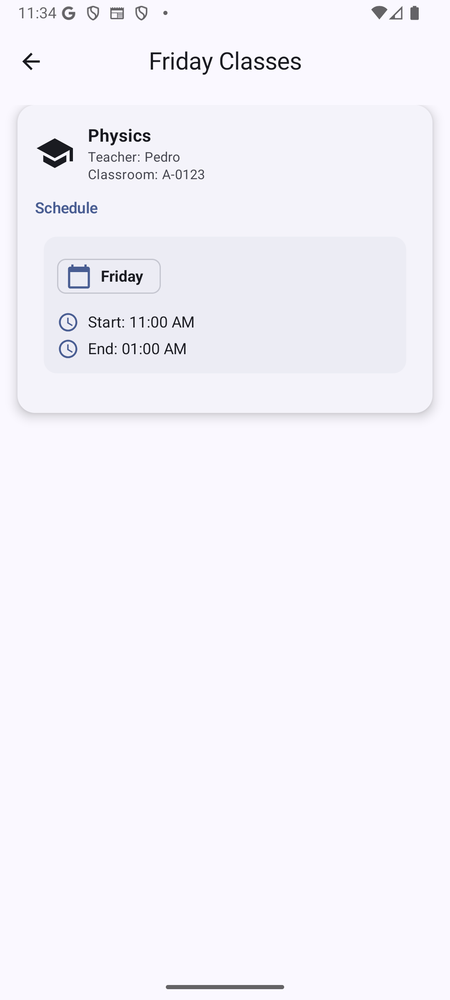

# 📘 Class Scheduler

**Class Scheduler** is an Android application built with **Kotlin** and **Jetpack Compose**, designed to help students manage and visualize their weekly class schedules easily and efficiently. Even within a limited development timeframe, the app delivers a refined and user‑friendly experience with a solid set of core features.

---

## 📚 Overview

The app provides a structured way for students to:

* Register their classes with detailed information
* View their weekly schedule at a glance
* Receive reminders before each class
* Sync their schedule through Firebase
---

## Screenshots

### 🏠 Home


### 📖 Class Details


---

## 🎉 Features

### 🧭 Onboarding Experience

A smooth and informative onboarding flow that guides new users through the app setup and key functionality.

### 📅 Weekly Class Schedule

A clean, intuitive **weekly grid layout (Monday to Friday)** displaying all registered classes as time‑based blocks. Students can visually identify schedule gaps, overlaps, and daily activities.

### ➕ Add & Manage Classes

A dedicated form where users can enter:

* Class name
* Class code
* Professor name
* Classroom location
* Days of the week
* Start and end time

Classes can be edited or deleted at any time.

### 🔍 Class Details View

Tapping on a day filter block reveals detailed information about that classes in that day, including:

* Class name
* Code
* Professor
* Classroom
* Full schedule

### 🔔 Class Reminders

Receive notifications **15 minutes before the start of each class**, ensuring students never miss a session. Implemented using `AlarmManager`.

### ☁️ Firebase Cloud Sync

The app integrates with **Firebase Authentication** for secure logins and **Firestore** to back up class schedules and sync them across devices.

---

## 🔧 Tech Stack & Architecture

* **Kotlin**
* **Jetpack Compose** for UI
* **ViewModel** + **StateFlow** (MVVM architecture)
* **Firebase Authentication** (sign‑in / sign‑up / reset-password)
* **Cloud Firestore** 
* **AlarmManager** for notifications
* **Material Design 3** components

---

## 🛠️ Installation & Configuration

### 1. Clone the repository

```bash
git clone https://github.com/Szxro/class-scheduler.git
```

### 2. Open the project in Android Studio

Ensure you are using the latest stable version of Android Studio.

---

## 🔧 Firebase Setup (Required)

### **1. Add `google-services.json`**

1. Open the **Firebase Console**.
2. Add a new Android app using your app's package name.
3. Download `google-services.json`.
4. Place it inside the project at:

```
/app/google-services.json
```

### **2. Add Web Client ID to `local.properties`** (Required)

In Firebase Console, under:
**Project Settings → General → Your Apps → OAuth Client IDs**

Find the client labeled:
**Web client (auto created by Google Services)**

Then open your project's `local.properties` file and add:

```
WEB_CLIENT_ID=YOUR_WEB_CLIENT_ID_HERE
```

## 📄 License

This project is released under the **MIT License**.

---
